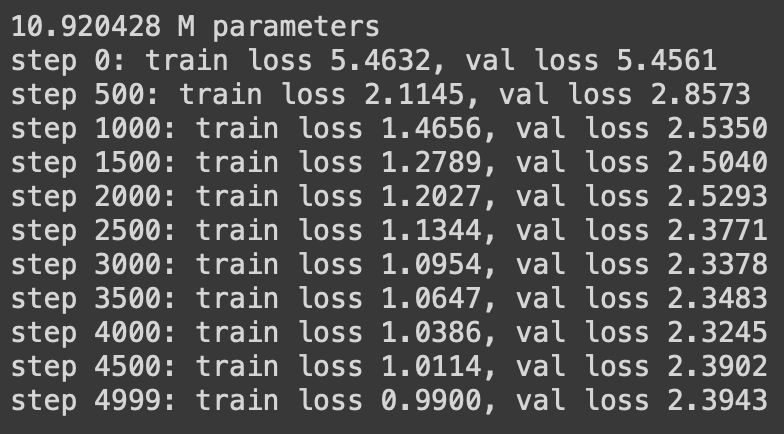

# DocGPT (A Decoder-Only Implementation of GPT's Architecture)

This project is an implementation of the GPT (Generative Pre-trained Transformer) architecture. The model is specifically designed as a decoder-only variant. It has been trained on a dataset comprised of physiology books. This project is an understanding of Andrej Karpathy's Neural Network series.

## Project Overview

The project consists of two primary parts:

### 1. Bigram Model

This section aims to introduce the basic implementation of the Bigram probabilistic model. It serves as a fundamental step to understanding attention mechanisms.

### 2. DocGPT Notebook

The notebook named "DocGPT" forms the core of the project. Initially, the dataset comprised approximately 10 million characters extracted from physiology books. The data has undergone preprocessing, and an architecture encompassing liner layer, softmax, multi-head attention, feed-forward layers, residual connections, and dropout has been developed.

The layer ordering within this architecture is inspired by the "Attention Is All You Need" paper, defining the Transformer architecture. This implementation focuses solely on a decoder-based language model to simplify the complexity of implementation.

## Training Metrics and Results

### Training Metrics

[Training Metrics Image]

Final Results: train loss 1.1304, val loss 1.4530

[Output Image]

## Note on Generations

It's important to note that the generations produced by the model are currently random. The model has not undergone fine-tuning specifically for question-answering tasks.
